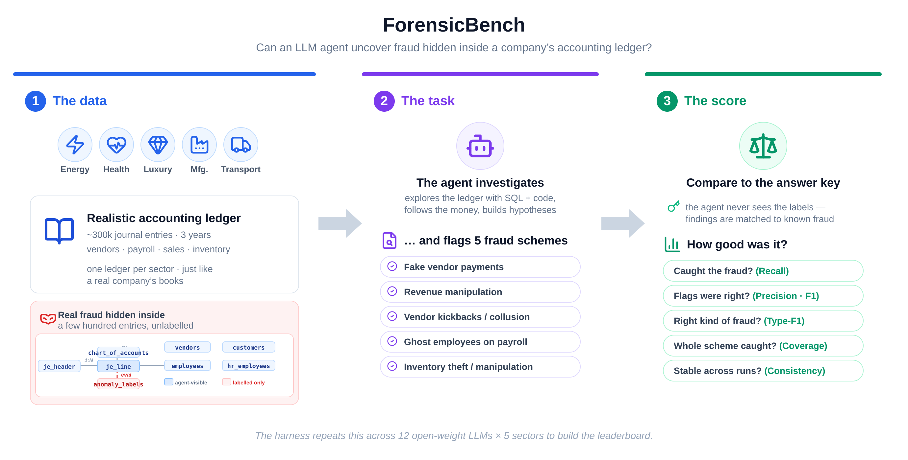
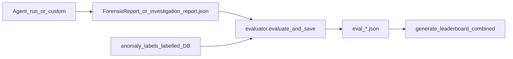

# ForensicBench

**Anonymous code release:** [https://anonymous.4open.science/r/Forensic_Bench-5301/](https://anonymous.4open.science/r/Forensic_Bench-5301/)

Reference implementation for **ForensicBench** (EMNLP 2026 Industry Track): a benchmark for evaluating agentic LLMs on scheme-level journal-entry fraud detection.

This repository contains the **reference agent**, **evaluation harness**, and **reproduction scripts** for the 12 open-weight models reported in the paper. It is an anonymized release of the research codebase (`researchpkg`).

### Overview



The figure summarizes the benchmark in three steps: **sector ledgers** with hidden fraud, the **agent investigation** (SQL + code, five fraud schemes), and **offline scoring** against ground-truth labels. The inset in *The data* shows the per-sector GL schema (eight linked SQL tables; `anomaly_labels` is evaluator-only).

Editable vector source: `forensicbench_overview.svg`. For LaTeX: `forensicbench_overview.pdf`.

### Benchmark at a glance

| | |
|---|---|
| **Task** | An agentic LLM investigates a sector ledger in PostgreSQL and reports **scheme-level fraud** (flagged journal entries + canonical scheme label). |
| **Input** | Read-only agent database per sector (`datasynth_forensic_public__<sector>`): no fraud-label columns, no ground-truth table. |
| **Output** | Structured suspicion list (`document_id`, scheme type, rationale); scored offline against a separate labelled database. |
| **Schemes (5)** | Fictitious AP disbursements · Revenue manipulation · Vendor collusion · Shadow payroll · Inventory manipulation |
| **Agent tools** | SQL, scratchpad, code interpreter, CSV export, suspicion reporting (default set; configurable via `--tools`) |
| **Run budget** | 20M input tokens per investigation (paper setting); temperature 0 |
| **Metrics (6)** | E-F1 · Type-F1 · Recall · Precision · Coverage · Consistency |

### Forensic Ledger datasets (5 sectors)

Each sector is a synthetic multi-company ledger (~3 years of postings). Archives ship as `datasets/<sector>.tar.zst` (~610 MB total compressed).

| Sector | JE headers | JE lines | Fraud rows | Posting period |
|--------|-----------:|---------:|-----------:|----------------|
| energy | 301,473 | 603,514 | 684 | 2023-01 — 2026-01 |
| healthcare | 301,537 | 603,705 | 768 | 2023-01 — 2026-01 |
| luxurygoods | 301,097 | 602,583 | 350 | 2023-01 — 2026-01 |
| manufacturing | 304,799 | 610,183 | 715 | 2023-01 — 2026-01 |
| transport | 301,232 | 602,928 | 481 | 2023-01 — 2026-01 |

### Database structure (per sector)

Loaded from `forensic_llm.sql` + CSV exports. The **agent-visible** copy strips label columns and `anomaly_labels`.

| Table | Role |
|-------|------|
| `je_header` | Journal-entry headers (dates, document type, currency, reference, …) |
| `je_line` | Journal-entry lines (GL account, amounts, cost/profit center, auxiliary accounts, …) |
| `chart_of_accounts` | Hierarchical chart of accounts |
| `employees` | Employee master (payroll-related joins) |
| `hr_employees` | HR lifecycle events |
| `vendors` | Vendor master |
| `customers` | Customer master |
| `anomaly_labels` | Ground truth (labelled DB only; used by the evaluator, not the agent) |

## Repository layout

```
ForensicBench/
├── forensicbench_overview.svg   # Benchmark overview figure (editable source)
├── forensicbench_overview.pdf   # Overview figure for LaTeX
├── forensicbench_overview.png   # Overview figure for README / slides
├── researchpkg/                 # Python package (installable)
│   ├── config.py
│   └── forensic_llm/            # Agent, evaluator, prompts, tools
│       ├── run.py
│       └── experiments/
│           └── datasets/        # Extracted sector exports (see Datasets)
├── datasets/                    # Compressed Forensic Ledger archives (~437 MB)
├── docker-compose.yml           # Dedicated Postgres for local reproduction
├── scripts/
│   ├── lib/
│   ├── smoke_test.sh            # Verify install + DB + optional LLM probe
│   ├── datasets/                # Extract + PostgreSQL load helpers
│   ├── vllm/                    # vLLM server script per paper model
│   ├── bench/                   # Benchmark run scripts
│   └── leaderboard/
├── requirements.txt
└── pyproject.toml
```

## Key files for contributors

Use this map when extending fraud schemes, swapping the agent, or changing evaluation logic.

### Fraud schemes & ground truth

| File | Role |
|------|------|
| `researchpkg/forensic_llm/prompts/fraud_catalogue.py` | Agent-visible catalogue of the five scheme types (injected into every run; no injection parameters). Entry point for prompt alignment and new leaderboard participants. |
| `researchpkg/forensic_llm/prompts/minimal_scheme_cards.py` | Short scheme definitions (process anchor and economic meaning). |
| `researchpkg/forensic_llm/models.py` | `SchemeType` enum, `SuspicionItem`, `ForensicReport` — output contract expected by the evaluator. |
| `anomaly_labels` (CSV in labelled ledgers / labelled DB) | Ground truth: `document_id`, `anomaly_type`, `is_injected`, scheme metadata. Source of truth for all metrics. |
| `scripts/datasets/populate_psql.sh` | Builds **labelled** vs **public** databases; strips fraud columns and drops `anomaly_labels` from the agent DB. |
| `researchpkg/forensic_llm/experiments/summarize_dataset.py` | Utility: per-scheme fraud breakdown from `anomaly_labels.csv`. |

Multi-stage fraud **injection** (posting templates, scheme orchestration) is **not** in this repository; shipped ledgers in `datasets/<sector>.tar.zst` are pre-injected. To regenerate sectors or add a scheme at the data layer, contact the authors (see Datasets below).

### Evaluation harness

| File | Role |
|------|------|
| `researchpkg/forensic_llm/evaluator.py` | Core: `evaluate()`, `evaluate_schemes()`, `evaluate_and_save()` — E-F1, Type-F1, recall/precision, coverage; maps `anomaly_type` to canonical scheme labels. |
| `researchpkg/forensic_llm/investigation_report.py` | Assembles `investigation_report.json` and `report.md` after a run. |
| `researchpkg/forensic_llm/run.py` | Reference agent CLI; `--evaluate` calls `evaluate_and_save` and writes `eval_*.json`. |
| `researchpkg/forensic_llm/run_rule_based.py` | Rule-based oracle (appendix); uses the same evaluator. |
| `scripts/leaderboard/generate_leaderboard_combined.py` | Aggregates **5 sectors × 5 seeds**; re-evaluates via `evaluator.evaluate()`. |
| `scripts/leaderboard/generate_leaderboard.py` | Per-run leaderboard and documentation of the six metric axes. |

Evaluation flow:



### Reference agent (optional)

To replace the agent without changing evaluation:

| File | Role |
|------|------|
| `researchpkg/forensic_llm/agent.py` | Orientation, planning, and hypothesis workers. |
| `researchpkg/forensic_llm/prompts/system_prompt.py` | Runtime prompt assembly. |
| `researchpkg/forensic_llm/tools/` | SQL, code interpreter, `report_suspicion`, and other agent tools. |

## Requirements

| Component | Purpose |
|-----------|---------|
| **Python 3.10+** | Agent and evaluation harness |
| **Docker + Docker Compose** | Dedicated PostgreSQL (no host DB install) |
| **psql** | Load dataset SQL exports (`postgresql-client` on Ubuntu) |
| **zstd + tar** | Extract `datasets/*.tar.zst` archives |
| **vLLM** (separate) | Serve open-weight models; not bundled in this repo |
| **HuggingFace access** | Model weights for checkpoints in `scripts/vllm/` |

Python dependencies are listed in `requirements.txt` / `pyproject.toml` (`openai`, `psycopg2-binary`, `transformers`, etc.).

### Install

```bash
cd ForensicBench
python -m venv .venv
source .venv/bin/activate
pip install -e .
```

### Verify setup (smoke test)

Confirms dependencies, Docker Postgres, one-sector dataset load, and agent DB access. Takes a few minutes; does **not** run a full investigation (those take hours).

```bash
source .venv/bin/activate
./scripts/smoke_test.sh

# If vLLM is already running, also probe the model endpoint:
./scripts/smoke_test.sh --with-llm http://localhost:8027/v1 Qwen/Qwen3.6-27B-FP8
```

## Datasets

ForensicBench ships the **five sector Forensic Ledger exports** used in the paper as compressed archives:

```
datasets/
  energy.tar.zst
  healthcare.tar.zst
  luxurygoods.tar.zst
  manufacturing.tar.zst
  transport.tar.zst
  SHA256SUMS
```

### 1. Start Postgres in Docker

```bash
./scripts/datasets/docker_db_up.sh
# localhost:55432  user=postgres  password=forensicbench
```

### 2. Extract archives and load into Postgres

```bash
cd datasets && sha256sum -c SHA256SUMS && cd ..

# Extract archives into the agent dataset path
./scripts/datasets/extract_datasets.sh

# Load all sectors (creates labelled + LLM-visible DBs per sector)
source scripts/datasets/docker_db_env.sh
./scripts/datasets/populate_psql_all_datasets.sh
```

This creates read-only agent databases `datasynth_forensic_public__<sector>` (ground-truth labels remain in separate labelled databases).

Point the agent at the Docker Postgres (also set when you `source docker_db_env.sh`):

```bash
export FORENSIC_DB_HOST=localhost
export FORENSIC_DB_PORT=55432
export FORENSIC_DB_USER=postgres
export FORENSIC_DB_PASSWORD=forensicbench
```

The **dataset generator** (modified DataSynth fork) is not included in this release; contact the authors if you need to regenerate sectors or extend the fraud catalogue.

## Quick start: single run

Prerequisites: smoke test passed, vLLM serving your model, `source scripts/datasets/docker_db_env.sh`.

```bash
export FORENSICBENCH_ROOT="$(pwd)"
source .venv/bin/activate

# Example: model already served at localhost:8027
python -m researchpkg.forensic_llm.run \
  --provider openai_compatible \
  --base-url http://localhost:8027/v1 \
  --api-key dummy \
  --model Qwen/Qwen3.6-27B-FP8 \
  --temperature 0 \
  --top-p 1 \
  --task full \
  --max-tokens 20000000 \
  --db-host localhost \
  --db-port 55432 \
  --db-user postgres \
  --db-password forensicbench \
  --db-name datasynth_forensic_public__energy \
  --output-dir researchpkg/forensic_llm/experiments/results/energy/qwen36_27b \
  --evaluate \
  --enable-thinking
```

## Full paper reproduction (12 models × 5 sectors)

### 1. Start vLLM for a model

Each paper model has a dedicated server script in `scripts/vllm/`. Scripts set `SAFETENSORS_FAST_GPU=1`, enable native tool calling (`--enable-auto-tool-choice`), and use model-specific parsers (e.g. `minimax_m2` + `minimax_m2_append_think` for MiniMax-M2.7, `qwen3_coder` + `qwen3` for Qwen3.x).

| Script | Paper model | Port | TP | Tool / reasoning parsers |
|--------|-------------|------|----|-------------------------|
| `serve_minimax_m27.sh` | MiniMax-M2.7 | 8229 | 2 | `minimax_m2` / `minimax_m2_append_think` |
| `serve_qwen35_397b.sh` | Qwen3.5-397B | 8397 | 4 | `qwen3_coder` / `qwen3` (+ expert parallel) |
| `serve_qwen35_122b.sh` | Qwen3.5-122B | 8122 | 2 | `qwen3_coder` / `qwen3` |
| `serve_qwen36_35b.sh` | Qwen3.6-35B | 8036 | 1 | `qwen3_coder` / `qwen3` |
| `serve_mistral_medium_128b.sh` | Mistral-Medium-3.5-128B | 8128 | 2 | `mistral` / `mistral` |
| `serve_gemma4_31b.sh` | Gemma-4-31B | 8031 | 2 | `gemma4` / `gemma4` |
| `serve_gemma4_e4b.sh` | Gemma-4-E4B | 8004 | 1 | `gemma4` |
| `serve_mistral_small_119b.sh` | Mistral-Small-4-119B | 8119 | 2 | `mistral` / `mistral` |
| `serve_qwen35_9b.sh` | Qwen3.5-9B | 8009 | 1 | `qwen3_coder` / `qwen3` |
| `serve_granite_30b.sh` | Granite-30B | 8030 | 1 | `granite4` |
| `serve_llama33_70b.sh` | Llama-3.3-70B | 8070 | 2 | `llama3_json` |
| `serve_gpt_oss_120b.sh` | GPT-OSS-120B | 8120 | 2 | `openai` |

Override defaults with environment variables: `VLLM_TENSOR_PARALLEL_SIZE`, `VLLM_PORT`, `VLLM_MAX_MODEL_LEN`, `VLLM_MAX_NUM_SEQS`, `MODEL_NAME`.

```bash
./scripts/vllm/serve_qwen35_122b.sh
```

### 2. Run the benchmark harness

```bash
# Sequential (one sector after another)
./scripts/bench/run_qwen35_122b_all_datasets.sh

# Parallel (all 5 sectors concurrently)
./scripts/bench_parallel/run_qwen35_122b_all_datasets.sh

# Wait until vLLM is ready before starting
WAIT_FOR_LLM=1 ./scripts/bench/run_qwen35_122b_all_datasets.sh
```

Each script runs the reference agent at **temperature 0** under a **20M input-token budget**, with evaluation enabled. Results are written to:

```
researchpkg/forensic_llm/experiments/results/<sector>/<model_subdir>/<timestamp>_full_.../
```

Repeat for all 12 models (one vLLM server at a time, or one per GPU group).

### 3. Rule-based oracle (appendix)

```bash
./scripts/bench/run_rule_based_all_datasets.sh
```

### 4. Generate the leaderboard

After all runs complete (5 replicates per sector per model for the paper's 5×5 protocol):

```bash
cd scripts/leaderboard
export PYTHONPATH="$(cd ../.. && pwd):${PYTHONPATH:-}"
python generate_leaderboard_combined.py \
  ../../researchpkg/forensic_llm/experiments/results \
  --md-out LEADERBOARD.md
```

## Evaluation metrics

The harness reports six metrics per run (see paper §4):

| Metric | Description |
|--------|-------------|
| **E-F1** | Entry-level F1 (flagged journal entries) |
| **Type-F1** | Scheme-type F1 (correct canonical label) |
| **Recall / Precision** | Entry-level detection rates |
| **Coverage** | Mean fraction of each scheme instance recovered |
| **Consistency** | Cross-seed stability (0–100) |

## Configuration

Most settings are controlled via environment variables (see `researchpkg/forensic_llm/config.py`):

| Variable | Default | Purpose |
|----------|---------|---------|
| `FORENSIC_LLM_BASE_URL` | `http://localhost:8020/v1` | LLM API endpoint |
| `FORENSIC_LLM_API_KEY` | `dummy` | API key (vLLM accepts any string) |
| `FORENSIC_MODEL_CONTEXT_WINDOW` | `128000` | Context window cap (match vLLM `max_model_len`) |
| `FORENSIC_LLM_MAX_TOKENS_PER_STEP` | `16384` | Max completion tokens per step |

Scheme prompts and evaluation entry points are listed in [Key files for contributors](#key-files-for-contributors).

## Hardware notes

Paper experiments used **4× NVIDIA H200 (147 GB)** with **vLLM** (PagedAttention; Kwon et al., 2023). Tensor-parallel size per model is set in each `scripts/vllm/serve_*.sh` script and should be adjusted for your GPU topology.

## Citation

```bibtex
@inproceedings{forensicbench2026,
  title={ForensicBench: Evaluating Agentic {LLM}s on Journal-Entry Fraud Detection},
  booktitle={EMNLP 2026 Industry Track},
  year={2026}
}
```

## License

MIT (code). Dataset and fraud catalogue descriptions are subject to the ForensicBench release terms.
